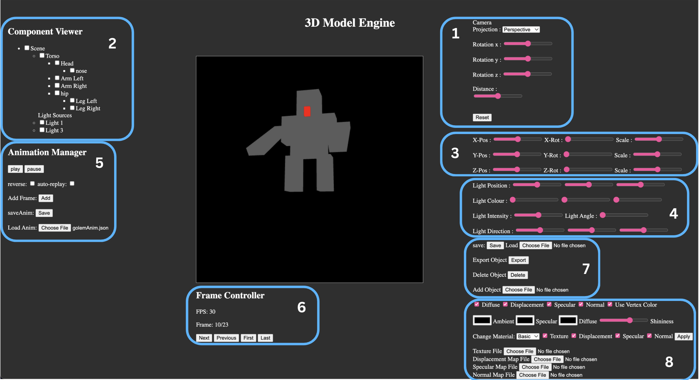

# IF3260 Grafika Komputer Tugas Besar 2
# 3D WebGL Hollow & Articulated Model
## Deskripsi Program
Pada tugas ini, kelompok kami telah membuat sebuah program 3D menggunakan WebGL murni, tanpa library/framework tambahan yang mampu menampilkan hollow dan articulated model. Terdapat 5 jenis hollow model yang dibuat oleh masing-masing anggota, yaitu batako, chain, cube, infinity cube, dan nether. Terdapat juga 5 articulated model yang dibuat yaitu creeper, golem, shulker, steve, dan wither.

## Cara Menjalankan
1. Lakukan clone repository ini
2. Buka file index.html yang terdapat pada folder src dengan menggunakan fitur LiveServer dari IDE Anda.
3. Pastikan canvas berhasil muncul pada halaman web dengan baik.
4. Untuk pengalaman penggunaan yang lebih baik, jalankan webapp ini di 75% zoom pada browser Anda.

## Panduan Penggunaan

### 1. Camera Control
Di bagian atas kanan ada beberapa control camera seperti jenis proyeksi dan beberapa slider sesuai dengan jenis proyeksinya. Untuk mengubah posisi maupun rotasi kamera, bisa menggunakan slider maupun click maupun scroll di canvas.

### 2. Component Viewer
Bagian ini memiliki kegunaan untuk memilih objek mana saja yang ingin dimanipulasi. Contohnya seperti pada gambar diatas, ada beberapa checkbox yang dapat digunakan untuk memilih benda mana saja yang akan dimanipulasi.

### 3. Component Editor
Bagian ini akan memanipulasi object-object yang telah dipilih dari component viewer. Untuk manipulasinya sendiri ada rotasi di sumbu x, y, z dan juga translasi di sumbu x, y, z.

### 4. Light Control
Bagian ini akan mengatur lighting mulai dari posisinya dengan format x, y, z kemudian warnanya dengan 3 slider yang mengatur RGB dan yang terakhir adalah slider yang mengatur intensitas cahayanya.

### 5. Animation Manager
Bagian ini digunakan untuk mengatur animasi mulai dari memainkan animasi, memberhentikan animasi, menambahkan frame baru, save animasi menjadi json, dan load animasi dari json yang sudah didownload.

### 6. Frame Controller
Frame Controller memiliki beberapa kegunaan diantaranya untuk melihat berapa fps animasi dijalankan dan juga melihat frame by frame animationnya.

### 7. Settings
Bagian ini memiliki 4 button dimana fungsinya natara lain adalah save to json, load from json, kemudian delete selected object, dan add object to selected object.

## Members
| NIM | Nama |Pembagian Kerja |Hollow Model | Articulated Model|
| --- | -----| ---|----- | -----
| 13521003 |Bintang Hijriawan J.| |infinity cube| shulker
| 13521007 |Matthew Mahendra| Rendering (Shaders, Pipeline), Texture, Component Viewer and Editor, Utils(Matrix4x4, Vector), Basic Material |nether | creeper
| 13521012 |Haikal Ardzi S.|Oblique Projection, Geometries, Save/Load, Animation Builder and Manager, Quaternion|chain |steve
| 13521022 |Raditya Naufal A.| Camera, Component editor, Save, Object manipulation|batako | golem
| 13521027 |Agsha Athalla N.| Mesh, Add-remove Object, Camera Controller, Orbit Control, Component Editor |cube| wither
